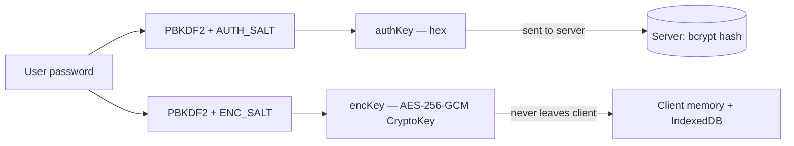
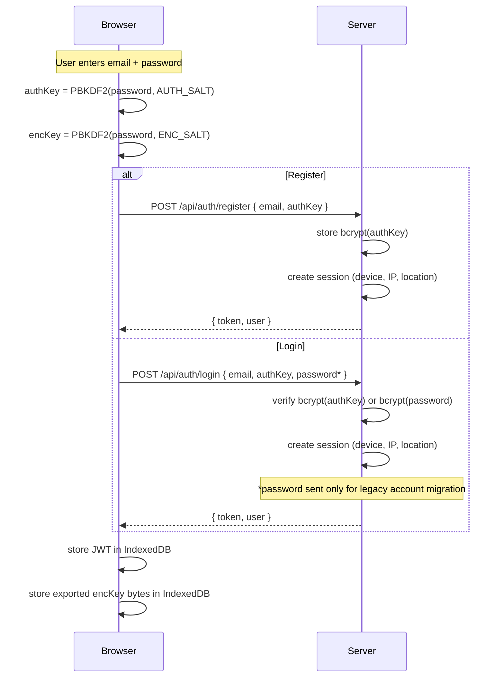
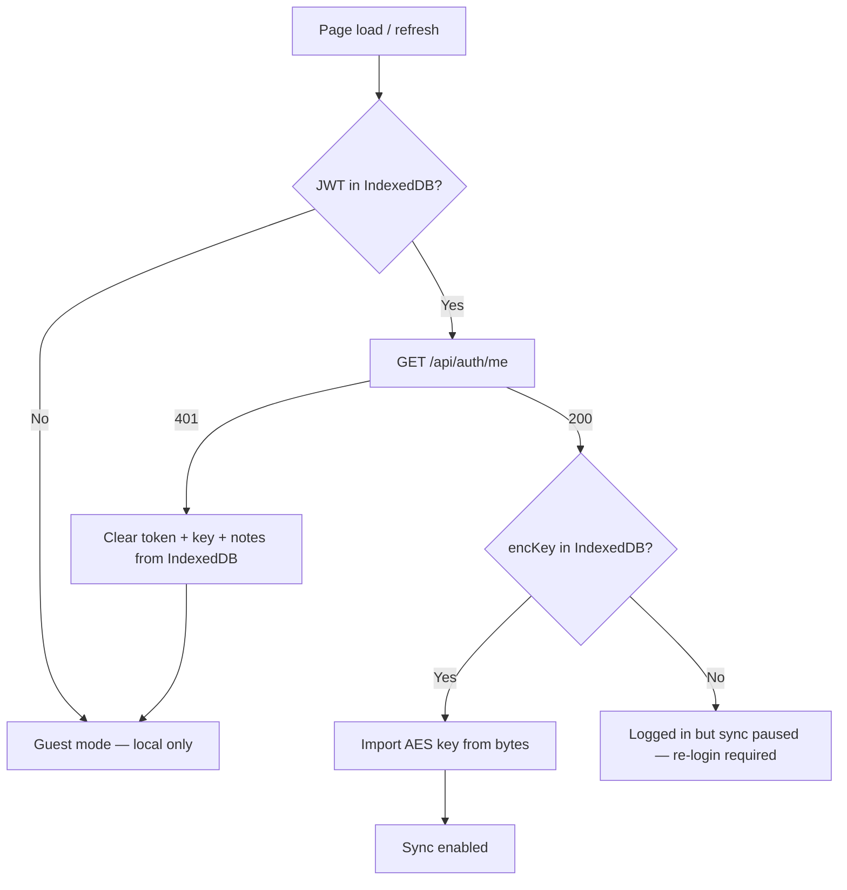
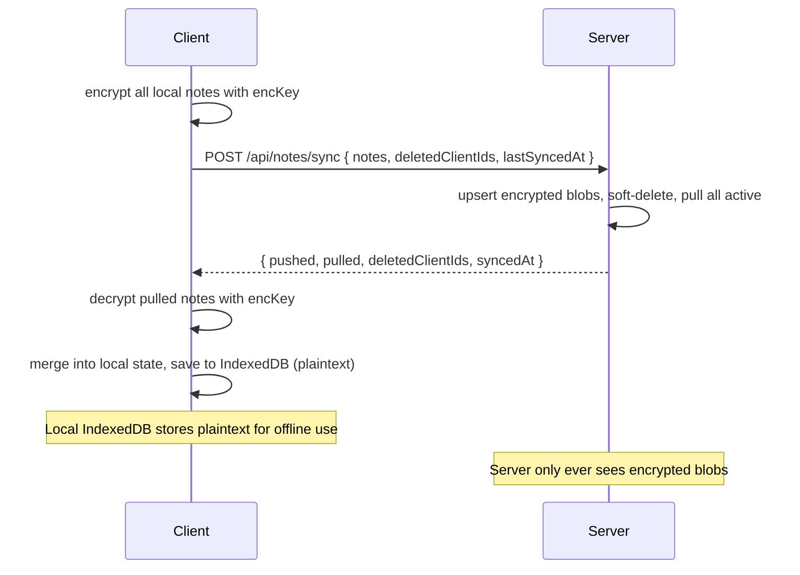
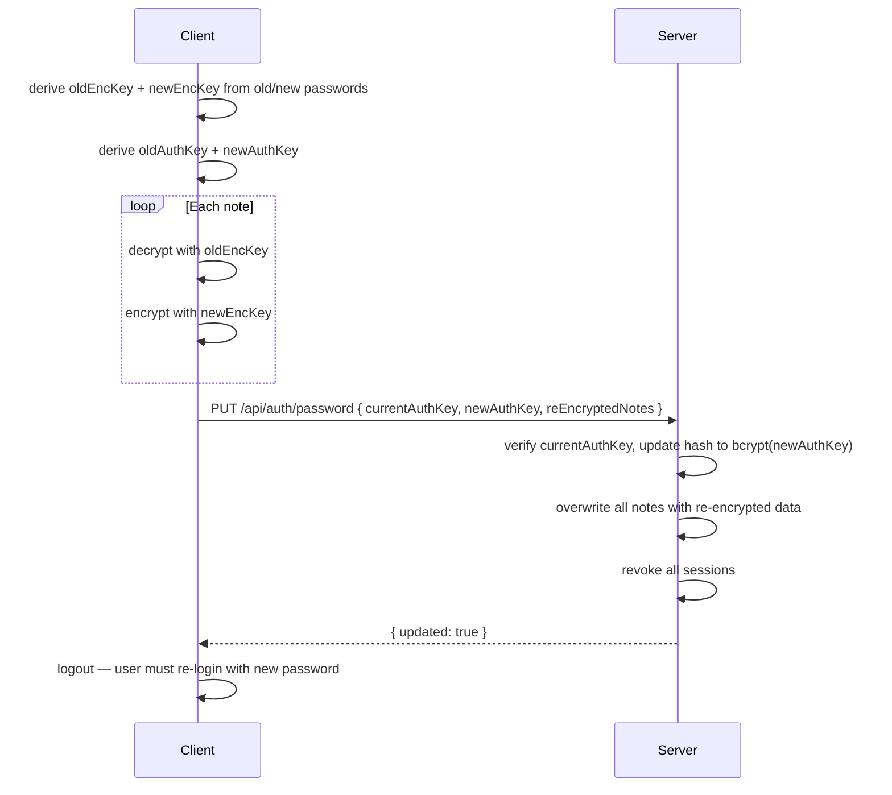

# Numori Notes — notes that calculate

**Free, open-source notes app with a built-in natural language calculator.**

Do math with natural language and get results in real time as you type. Just write `200 GBP in EUR` or `15% of 340` and the answer appears inline. Cloud sync with end-to-end encryption, export to multiple formats, and full i18n support — all 100% free and open source (AGPLv3). Your data stays yours.

### What it does

- **Natural language math** — type `half of 500`, `30% off 89.99`, `sqrt(144)`, or `3 hours 20 min + 45 min` and see results live as you write
- **Full notepad** — markdown support, multiple notes, tags, search, templates, and export to PDF, HTML, Markdown, and plain text
- **Note groups** — organise notes into groups, create groups from bulk selection, drag-and-drop reordering
- **45+ currencies with live rates** — `100 GBP in JPY` just works, updated on every session
- **Unit conversions** — length, weight, volume, temperature, area, speed, data, time, CSS units, and more
- **Date & time** — `days until christmas`, `today + 3 weeks`, timezone conversions
- **Variables** — `rent = 1200` then use `rent` in later lines
- **Aggregation** — `sum` and `average` across previous lines
- **Cloud sync with E2E encryption** — optional account, end-to-end encrypted, the server never sees your notes
- **Session management** — view active sessions across devices, revoke any session remotely, automatic logout on revoked devices
- **Email verification & password recovery** — verify your email, recover your account with OTP-based password reset
- **Works everywhere** — PWA for desktop and mobile browsers, plus native iOS and Android via Capacitor
- **Offline-first** — everything runs client-side with IndexedDB; no internet required for core features
- **Share notes** — password-protected shared links with view analytics
- **App lock** — optional PIN/biometric lock for the native mobile apps with configurable auto-lock timeout
- **Privacy screen** — automatic screen content hiding when the app is backgrounded on mobile
- **i18n** — English and Spanish, easy to add more
- **In-app updates** — automatic update detection with toast notifications

Built with Nuxt 4, Vue 3, CodeMirror, Tailwind CSS, and Dexie.js.

## Prerequisites

- Node.js 22.20.0 (pinned in `mise.toml` — use [mise](https://mise.jdx.dev/) or nvm)
- npm

## Getting started

```bash
cp .env.example .env       # configure environment (see .env.example)
npm install --include=dev   # --include=dev is required (see note below)
npm run dev                 # http://localhost:3000
```

> **Note:** If your npm config has `omit=dev` set (e.g. for cleaner `npm audit` output), devDependencies like `@capacitor/cli` and `vitest` won't be installed by default. Use `npm install --include=dev` to ensure everything is available.

## Scripts

| Command              | Description                              |
| -------------------- | ---------------------------------------- |
| `npm run dev`        | Start dev server with HMR                |
| `npm run build`      | Production build (outputs to `.output/`) |
| `npm run preview`    | Preview production build locally         |
| `npm run generate`   | Static site generation                   |
| `npm run test`       | Run all tests once (vitest)              |
| `npm run test:watch` | Run tests in watch mode                  |

## Project structure

```
├── app.vue                        # Root app component
├── db.js                          # Dexie (IndexedDB) database schema
├── pages/
│   ├── index.vue                  # Main SPA page — editor, sidebar, modals
│   └── shared/
│       └── [hash].vue             # Public shared-note viewer
├── components/
│   ├── ui/                        # Reusable UI primitives
│   │   ├── Alert.vue              # Alert / banner component
│   │   ├── Avatar.vue             # User avatar
│   │   ├── Badge.vue              # Status / label badge
│   │   ├── Button.vue             # Button with variants, sizes, loading state
│   │   ├── ButtonsGroup.vue       # Grouped button container
│   │   ├── Checkbox.vue           # Checkbox input
│   │   ├── Divider.vue            # Horizontal divider
│   │   ├── Dropdown.vue           # Dropdown menu container
│   │   ├── DropdownItem.vue       # Dropdown menu item
│   │   ├── DropdownRow.vue        # Dropdown row layout
│   │   ├── DropdownSubmenu.vue    # Nested dropdown submenu
│   │   ├── FileInput.vue          # File upload input
│   │   ├── FormField.vue          # Form field wrapper with label / error
│   │   ├── Input.vue              # Text input
│   │   ├── Kbd.vue                # Keyboard shortcut badge
│   │   ├── ListMenu.vue           # Vertical list menu
│   │   ├── ListMenuItem.vue       # Single item in a list menu
│   │   ├── Modal.vue              # Modal dialog
│   │   ├── Popup.vue              # Popup / popover
│   │   ├── ProgressBar.vue        # Progress bar
│   │   ├── Prompt.vue             # Confirmation prompt dialog
│   │   ├── Select.vue             # Select dropdown
│   │   ├── Slider.vue             # Range slider
│   │   ├── Stepper.vue            # Numeric stepper
│   │   ├── Toggle.vue             # Toggle switch
│   │   └── Tooltip.vue            # Tooltip
│   ├── settings/                  # Settings modal sub-components
│   │   ├── Behaviour.vue          # Behaviour preferences (auto-save, etc.)
│   │   ├── ConfirmModal.vue       # Settings confirmation dialog
│   │   ├── Cursor.vue             # Cursor style preferences
│   │   ├── DangerZone.vue         # Account deletion / data wipe
│   │   ├── General.vue            # General settings tab
│   │   ├── Layout.vue             # Layout preferences (sidebar, editor)
│   │   ├── Locales.vue            # Language / locale settings
│   │   ├── Modal.vue              # Settings modal shell with tab navigation
│   │   ├── Profile.vue            # User profile settings
│   │   ├── Results.vue            # Calculator result display settings
│   │   ├── SectionHeader.vue      # Reusable settings section header
│   │   ├── Security.vue           # Security settings (app lock, privacy screen)
│   │   ├── Sessions.vue           # Active sessions management
│   │   ├── SharedNotes.vue        # Shared notes management
│   │   └── Typography.vue         # Font and typography preferences
│   ├── AboutModal.vue             # About / credits modal
│   ├── AddToGroupModal.vue        # Add note(s) to a group
│   ├── AppHeader.vue              # Top bar with title, menus, and actions
│   ├── AppLockScreen.vue          # PIN / biometric lock screen overlay
│   ├── AuthModal.vue              # Login / register modal
│   ├── AvatarEditor.vue           # Avatar upload / crop
│   ├── ConfirmBulkDeleteModal.vue # Bulk-delete confirmation
│   ├── ConfirmDeleteModal.vue     # Single-delete confirmation
│   ├── DeleteGroupModal.vue       # Group deletion confirmation
│   ├── EmailVerificationBanner.vue # Email verification prompt banner
│   ├── EmailVerificationModal.vue # Email verification OTP modal
│   ├── ExportOptionsModal.vue     # Export format picker
│   ├── FileDropdown.vue           # File menu dropdown
│   ├── FormattingToolbar.vue      # Markdown formatting toolbar
│   ├── GroupListItem.vue          # Single group row in the sidebar
│   ├── GroupModal.vue             # Create / rename group modal
│   ├── HelpModal.vue              # In-app documentation modal
│   ├── MainSidebar.vue            # Notes list sidebar with search, tags, groups, CRUD, and account menu
│   ├── NoteEditor.vue             # CodeMirror editor wrapper with calc integration
│   ├── NoteListItem.vue           # Single note row in the sidebar
│   ├── NoteMetaModal.vue          # Note rename / metadata / share modal
│   ├── OfflineIndicator.vue       # Offline status indicator
│   ├── ShareAnalyticsModal.vue    # Shared note view analytics
│   ├── SharedNoteToolbar.vue      # Toolbar for the public shared-note page
│   ├── ShareModal.vue             # Share a note (password, link, analytics)
│   ├── SyncIndicator.vue          # Sync status indicator
│   ├── TemplatesModal.vue         # Calculation templates picker
│   ├── ThemeSwitcher.vue          # Light / dark mode toggle
│   ├── ToastNotification.vue      # Toast notification component
│   ├── UpdateNotification.vue     # In-app update available notification
│   ├── ViewDropdown.vue           # View menu dropdown (zoom, markdown, theme toggle)
│   └── WelcomeWizard.vue          # First-run onboarding wizard
├── composables/
│   ├── calculator/                # Calculator engine modules
│   │   ├── index.js               # Main entry — line-by-line pipeline
│   │   ├── aggregation.js         # sum / total / average
│   │   ├── constants.js           # pi, e, tau, phi, etc.
│   │   ├── currency.js            # Live exchange rates + conversion
│   │   ├── datetime.js            # Date / time / duration / timezone
│   │   ├── extract.js             # Expression extraction and parsing helpers
│   │   ├── math.js                # Arithmetic, functions, trig, bitwise
│   │   ├── scales.js              # k, M, billion, trillion, SI prefixes
│   │   ├── units.js               # Unit conversion (length, weight, …)
│   │   ├── data/
│   │   │   ├── currencies.json    # Currency codes and metadata
│   │   │   └── timezones.json     # Timezone aliases and mappings
│   │   └── __tests__/             # Calculator engine tests (colocated)
│   ├── useApi.js                  # API fetch wrapper (app-level)
│   ├── useApiBase.js              # Base fetch helper (shared with shared page)
│   ├── useAppLock.js              # PIN / biometric app lock state and logic
│   ├── useAuth.js                 # Auth state, key derivation, session persistence and validation
│   ├── useAuthHandlers.js         # Auth event handlers (login, register, logout flows)
│   ├── useNumoriLanguage.js       # Custom CodeMirror language (numori)
│   ├── useCalculator.js           # Calculator composable (delegates to calculator/)
│   ├── useCodeHighlight.js        # Syntax highlighting helpers
│   ├── useDisplayFormatter.js     # Number / result display formatting
│   ├── useEditorDecorations.js    # CodeMirror editor decorations
│   ├── useEditorInteractions.js   # Editor interaction handlers
│   ├── useEditorStyles.js         # Editor styling configuration
│   ├── useFileActions.js          # Export, import, duplicate, print
│   ├── useGroupManagement.js      # Group CRUD and sync operations
│   ├── useGroups.js               # Group state and local persistence
│   ├── useHasVirtualKeyboard.js   # Virtual keyboard detection
│   ├── useKeyboardShortcuts.js    # Global keyboard shortcut bindings
│   ├── useLocalePreferences.js    # Locale and display preferences state
│   ├── useNativeKeyboardToolbar.ts # iOS native keyboard accessory bridge
│   ├── useNoteActions.js          # Note-level action handlers
│   ├── useNotes.js                # Note CRUD + IndexedDB persistence
│   ├── useOnlineStatus.js         # Online / offline status tracking
│   ├── usePlatform.js             # Platform detection (web, ios, android)
│   ├── usePrivacyScreen.js        # Privacy screen (hide content when backgrounded)
│   ├── useServiceWorker.js        # Service worker registration and update handling
│   ├── useShareManagement.js      # Share CRUD and link management
│   ├── useSync.js                 # Cloud sync with E2E encryption
│   ├── useTemplates.js            # Predefined calculation templates
│   ├── useToast.js                # Toast notification state
│   └── useWelcomeWizard.js        # First-run wizard state
├── utils/
│   ├── crypto.js                  # E2E encryption: key derivation, AES-GCM encrypt/decrypt
│   ├── keyboard-toolbar.ts        # Native keyboard toolbar utilities
│   └── normaliseName.js           # Name normalisation helpers
├── plugins/
│   ├── deeplink.client.ts         # Deep link handler (Universal Links / App Links)
│   ├── pwa.client.ts              # PWA service worker registration
│   └── statusbar.client.ts        # Mobile status bar styling
├── server/
│   ├── api/
│   │   ├── auth/
│   │   │   ├── register.post.js   # POST /api/auth/register — create account
│   │   │   ├── login.post.js      # POST /api/auth/login — authenticate
│   │   │   ├── me.get.js          # GET  /api/auth/me — validate session
│   │   │   ├── profile.put.js     # PUT  /api/auth/profile — update profile
│   │   │   ├── password.put.js    # PUT  /api/auth/password — change password + re-encrypt
│   │   │   ├── privacy.put.js     # PUT  /api/auth/privacy — tracking preferences
│   │   │   ├── privacy-screen.put.js # PUT /api/auth/privacy-screen — toggle privacy screen
│   │   │   ├── security.put.js    # PUT  /api/auth/security — toggle security settings
│   │   │   ├── app-lock.put.js    # PUT  /api/auth/app-lock — configure app lock settings
│   │   │   ├── session-duration.put.js # PUT /api/auth/session-duration — configure session lifetime
│   │   │   ├── sessions.get.js    # GET  /api/auth/sessions — list active sessions
│   │   │   ├── sessions.delete.js # DELETE /api/auth/sessions — revoke all other sessions
│   │   │   ├── sessions/
│   │   │   │   └── [id].delete.js # DELETE /api/auth/sessions/:id — revoke single session
│   │   │   ├── logout.post.js     # POST /api/auth/logout — revoke current session
│   │   │   ├── delete.post.js     # POST /api/auth/delete — delete data or account
│   │   │   ├── send-verification.post.js  # POST /api/auth/send-verification — send email OTP
│   │   │   ├── verify-email.post.js       # POST /api/auth/verify-email — verify email OTP
│   │   │   ├── forgot-password.post.js    # POST /api/auth/forgot-password — request password recovery
│   │   │   ├── reset-password.post.js     # POST /api/auth/reset-password — reset password with token
│   │   │   └── verify-recovery.post.js    # POST /api/auth/verify-recovery — verify recovery OTP
│   │   ├── groups/
│   │   │   └── sync.post.js       # POST /api/groups/sync — bulk group sync
│   │   ├── notes/
│   │   │   ├── index.get.js       # GET  /api/notes — list notes
│   │   │   ├── index.post.js      # POST /api/notes — create / upsert note
│   │   │   ├── [id].put.js        # PUT  /api/notes/:id — update note
│   │   │   ├── [id].delete.js     # DELETE /api/notes/:id — soft-delete note
│   │   │   └── sync.post.js       # POST /api/notes/sync — bulk sync endpoint
│   │   ├── share/
│   │   │   ├── index.post.js      # POST /api/share — create shared note
│   │   │   ├── my.get.js          # GET  /api/share/my — list user's shares
│   │   │   ├── [hash].get.js      # GET  /api/share/:hash — view shared note
│   │   │   ├── [hash].delete.js   # DELETE /api/share/:hash — unshare
│   │   │   └── [hash]/
│   │   │       ├── analytics.get.js    # GET  — view analytics
│   │   │       ├── analytics.delete.js # DELETE — clear analytics
│   │   │       └── import.post.js      # POST — record import event
│   │   ├── sync/
│   │   │   └── events.get.js      # GET /api/sync/events — SSE endpoint
│   │   └── version.get.js         # GET /api/version — app version for update checks
│   ├── middleware/
│   │   └── cors.js                # CORS headers for API routes
│   ├── plugins/
│   │   ├── migrate.js             # Auto-run DB migrations on startup
│   │   └── purge-sessions.js      # Periodic expired session cleanup
│   └── utils/
│       ├── auth.js                # JWT sign / verify, requireAuth helper
│       ├── db.js                  # PostgreSQL connection pool + query helper
│       ├── email.js               # Email sending via nodemailer (SMTP)
│       ├── geo.js                 # Geolocation from request headers
│       ├── migrate.js             # SQL migration runner
│       ├── session.js             # Session creation, validation, revocation helpers
│       └── syncBroadcast.js       # SSE broadcast to connected clients
├── i18n/                          # i18n translation files (managed by @nuxtjs/i18n)
├── public/
│   ├── .well-known/
│   │   ├── apple-app-site-association  # iOS Universal Links verification
│   │   └── assetlinks.json             # Android App Links verification
│   ├── favicon.ico
│   ├── favicon.svg
│   ├── manifest.webmanifest
│   ├── robots.txt
│   └── sw.js                      # Service worker for PWA
├── nuxt.config.ts                 # Nuxt configuration (SSR disabled, modules, i18n)
├── tailwind.config.js             # Tailwind with custom color palette
├── vitest.config.js               # Vitest configuration
├── capacitor.config.ts            # Capacitor config (iOS + Android)
├── Dockerfile                     # Multi-stage production build
├── docker-compose.yml             # Production Postgres
├── docker-compose.dev.yml         # Local dev Postgres
└── mise.toml                      # Node.js version pinning
```

## Architecture

The app is a pure client-side SPA (`ssr: false` in `nuxt.config.ts`). All data is stored locally in IndexedDB via Dexie.js — there is no backend or database required for the current feature set.

### Key modules

- `useCalculator.js` — The core engine. Parses natural language input and evaluates arithmetic, percentages, unit conversions, currency exchange, date/time, variables, and aggregation (sum/average). This is where most of the logic lives and where most contributions will happen.
- `useNumoriLanguage.js` — Registers a custom CodeMirror language (`numori`) with syntax highlighting for numbers, operators, units, currencies, functions, and comments.
- `useNotes.js` — Manages multiple notes with auto-save to IndexedDB via Dexie.js.
- `useGroups.js` / `useGroupManagement.js` — Note group state and CRUD with cloud sync support.
- `useAppLock.js` — PIN / biometric app lock for native mobile apps with configurable auto-lock timeout.
- `usePrivacyScreen.js` — Hides app content when backgrounded on mobile (iOS/Android).
- `useTemplates.js` — Provides predefined templates (budget, cooking, fitness, etc.).
- `useToast.js` — Toast notification state management.
- `useServiceWorker.js` — Service worker registration and in-app update detection.

### Calculator engine overview

The calculator processes input line-by-line. Each line goes through this pipeline:

1. Check for formatting (headers `#`, comments `//`, labels `Label:`)
2. Check for variable assignment (`x = ...`)
3. Check for aggregation keywords (`sum`, `total`, `average`, `avg`)
4. Try timezone conversion
5. Try date/time expression
6. Try `fromunix()` function
7. Try number format conversion (`X in hex/bin/oct/sci`)
8. Try unit conversion (length, weight, volume, temp, area, speed, data, time, CSS, angular)
9. Try currency conversion
10. Fall back to regular math evaluation

Important implementation details:

- `mod` uses `⊘` as an internal placeholder to avoid conflict with the `%` percentage handler
- `xor` uses `⊕` to distinguish from `^` (exponentiation)
- Variable assignment is checked before sum/total keywords to prevent `total = X` from being caught as an aggregation
- The `times` word operator uses `\btimes\b` word boundary to avoid conflicts with date expressions
- Exchange rates are fetched live from [fawazahmed0/exchange-api](https://github.com/fawazahmed0/exchange-api) on startup, with hardcoded fallback rates for offline use

## Security & authentication

Numori Notes supports optional cloud sync with end-to-end encryption (E2E). The design ensures the server never has access to plaintext note content or the user's raw password.

### Key derivation

From a single user password, two independent keys are derived client-side using PBKDF2-SHA256 (600 000 iterations), each with a distinct salt:

| Key       | Purpose                                          | Leaves the client?                    |
| --------- | ------------------------------------------------ | ------------------------------------- |
| `authKey` | Hex string sent to the server for authentication | Yes (server stores `bcrypt(authKey)`) |
| `encKey`  | AES-256-GCM key used to encrypt/decrypt notes    | Never                                 |



### Registration & login



On login the server tries `authKey` first. For legacy accounts (created before E2E), it falls back to the raw password and transparently upgrades the stored hash to `bcrypt(authKey)`.

### Session persistence across page refresh

The JWT token and the exported `encKey` bytes (base64-encoded) are both persisted in IndexedDB via the Dexie `appState` table. This means the session survives page refreshes, tab closures, and browser restarts. Both are cleared on logout.

On page load, `restore()` recovers the JWT from IndexedDB, validates it against the server (`GET /api/auth/me`), and re-imports the `encKey` from IndexedDB. If either is missing or the token is invalid, the user must log in again. If the session was revoked remotely, `restore()` also clears all local notes from IndexedDB so no data is left behind.



### Session management

Each login, registration, or password reset creates a server-side session record in the `sessions` table. Sessions are identified by a SHA-256 hash of the JWT (the raw token is never stored server-side). Each session tracks:

- Device name (parsed from User-Agent)
- IP address
- Location (from reverse proxy / CDN geolocation headers, when available)
- Created timestamp
- Last-used timestamp (updated on every authenticated API call)

`requireAuth()` validates the session on every request — if the session row has been deleted (revoked), the request fails with 401 even if the JWT itself is still cryptographically valid. This means session revocation is immediate and doesn't depend on JWT expiry.

#### Revocation propagation

When a session is revoked remotely, the affected client is notified through three independent mechanisms (belt-and-suspenders):

1. **SSE push** — the server broadcasts a `session-revoked` message to all connected SSE clients. The receiving client calls `GET /api/auth/me` to check if its own session is still valid. If not, it clears all local data and logs out.
2. **Session heartbeat** — a 30-second interval polls `GET /api/auth/me` independently of SSE. This catches revocations when SSE isn't connected yet (e.g. immediately after login) or was temporarily disconnected.
3. **Sync 401 fallback** — if a sync request returns 401, the client treats it as a session revocation and clears local data.

When any of these paths detects a revoked session, the client clears notes from both memory and IndexedDB, removes auth tokens and encryption keys, and returns to guest mode.

#### Offline devices

Devices that are offline when their session is revoked will not receive the SSE notification. When they come back online, the `isOnline` watcher immediately triggers a session validation call. If the session was revoked, the device is logged out and local data is cleared before any sync can occur.

#### Session lifecycle

| Event                             | Session effect                           |
| --------------------------------- | ---------------------------------------- |
| Login / Register / Password reset | New session created                      |
| Any authenticated API call        | `last_used_at` updated                   |
| Logout                            | Current session deleted                  |
| Password change                   | All sessions deleted (re-login required) |
| "Close all other sessions"        | All sessions except current deleted      |
| "Close session" (specific)        | Target session deleted                   |
| Account deletion                  | All sessions cascade-deleted             |

### Email verification & password recovery

After registration, users can verify their email via an OTP code sent to their inbox. Verified emails unlock password recovery — if a user forgets their password, they can request a recovery OTP, verify it, and set a new password. Email is sent via SMTP using nodemailer.

### Encryption format

All sensitive note fields (title, description, tags, content) are encrypted individually with AES-256-GCM before being sent to the server. Each encrypted field is a JSON string:

```json
{ "iv": "<base64 — 12-byte nonce>", "ct": "<base64 — ciphertext + 16-byte auth tag>" }
```

The server stores these opaque strings as-is. Non-sensitive fields (clientId, sortOrder, timestamps) pass through unencrypted.

### Sync flow



Sync triggers: immediate on create/delete/reorder, debounced (3 s) on edits, 2-minute interval, and SSE push from other clients. A separate 30-second session heartbeat validates the session is still active independently of sync.

### Password change

Password change re-encrypts all notes atomically:



### Shared notes

Shared notes use a completely separate key derived from a share-specific password (user-chosen or randomly generated) with its own PBKDF2 salt (`SHARE_SALT`). This key is independent from the user's personal `encKey`.

### Legacy migration

On the first sync after E2E deployment, the client detects unencrypted (legacy) notes from the server by checking whether the `content` field parses as a `{ iv, ct }` JSON object. Legacy notes are used as-is locally and then re-uploaded encrypted in a one-time migration pass with a progress indicator.

### Known security limitations

The following items are known trade-offs or areas for future improvement:

1. **Hardcoded PBKDF2 salts** — The three salts (`AUTH_SALT`, `ENC_SALT`, `SHARE_SALT`) are static strings compiled into the client bundle. Ideally, salts should be per-user and stored server-side. This is acceptable for now because the salts serve to domain-separate the three derived keys (not to prevent rainbow tables — PBKDF2's iteration count handles that), but per-user salts would be stronger.

2. **Derived key in IndexedDB** — The raw AES-256 key bytes are stored in IndexedDB (base64-encoded via the Dexie `appState` table) to survive page refreshes and tab closures. Unlike `sessionStorage`, this persists across browser sessions until the user explicitly logs out. The key is accessible to any JavaScript running in the same origin, so an XSS vulnerability could exfiltrate it. Alternatives considered:
   - Non-extractable CryptoKey (original approach) — prevents export but is lost on refresh, breaking sync.
   - `sessionStorage` — tab-scoped and cleared on tab close, but doesn't survive tab closures or browser restarts, forcing frequent re-logins.
   - Service Worker vault — would isolate the key from the main thread but adds significant complexity.

3. **No key rotation mechanism** — There is no periodic key rotation. The `encKey` only changes when the user changes their password. A future improvement could introduce versioned keys.

4. **Server-side note metadata exposure** — While note content fields are encrypted, the server can still observe: number of notes, note sizes, timestamps, sort order, and sync frequency. A padding or fixed-size scheme could mitigate size-based analysis.

5. **JWT in IndexedDB** — The JWT is stored in IndexedDB (not httpOnly cookie) because the app is a client-side SPA that calls the API directly. This means the token is accessible to JavaScript and vulnerable to XSS. The token has an expiry, and server-side session management means stolen tokens can be revoked immediately via the Active Sessions UI. However, there is no refresh token rotation yet.

6. **Legacy password fallback** — During the migration period, the login endpoint accepts both `authKey` and raw `password`. The raw password is sent over TLS but does reach the server. Once all accounts are migrated, the raw password fallback should be removed.

## Testing

Tests are colocated alongside their source files in `__tests__/` directories — 709 tests across 31 test files covering calculator features, composables, server APIs, and utilities.

```bash
npm run test          # single run
npm run test:watch    # watch mode
```

### Test setup

The composable uses Nuxt's auto-imported `ref`. Since tests run outside Nuxt, we mock it:

```js
vi.stubGlobal('ref', (val) => ({ value: val }))
```

Tests use four helper functions:

```js
calc(expression) // evaluate single expression, return result string
calcNum(expression) // evaluate single expression, return parsed number
calcLines(lines) // evaluate multiple lines, return all result strings
calcLinesLastNum(lines) // evaluate multiple lines, return last result as number
```

### Test locations

```
composables/calculator/__tests__/   # Calculator engine tests (arithmetic, units, currency, datetime, …)
composables/__tests__/              # Composable tests (code highlight, file actions, locale, language)
server/api/auth/__tests__/          # Auth API tests (register, login, password, delete)
server/api/notes/__tests__/         # Notes API tests (sync, logout safety)
server/api/share/__tests__/         # Share API tests (create, get)
utils/__tests__/                    # Utility tests (crypto, crypto integration)
```

### Writing new tests

When adding a calculator feature, add tests to the appropriate `describe` block in the relevant test file under `composables/calculator/__tests__/`. If it's a new category, add a new test file following the existing naming pattern. All tests must pass before merging.

## i18n

Translations use [@nuxtjs/i18n](https://i18n.nuxtjs.org/) with the `no_prefix` strategy (no URL prefixes).

Current locales: `en-GB`, `es-ES`

To add a new locale:

1. Add the locale config to `nuxt.config.ts` under `i18n.locales`
2. Create the corresponding JSON translation files
3. Copy the structure from the `en-GB` files and translate

## Theming

Uses `@nuxtjs/color-mode` with `class` strategy (adds `dark` class to `<html>`). System preference is detected automatically.

Custom color palette is defined in `tailwind.config.js` with semantic names: `primary`, `success`, `warning`, `error`, and an extended `gray` scale optimized for dark mode.

## Docker

```bash
docker build -t numori-notes .
docker run -p 3000:3000 numori-notes
```

The Dockerfile uses a multi-stage build: build stage with full Node.js, production stage with just the `.output` directory running as a non-root user.

## Deep linking (Android App Links / iOS Universal Links)

The native apps are configured to open `https://notes.numori.app` links directly (e.g. shared note URLs like `/shared/:hash?key=...`).

### How it works

When a user taps a link to `notes.numori.app`, the OS checks verification files hosted on the domain to confirm the app is allowed to handle those URLs. If verified, the link opens in the app instead of the browser. The `plugins/deeplink.client.ts` Capacitor plugin then routes the URL path to Vue Router.

### Server-side verification files

Both files live in `public/.well-known/` and are deployed as static assets:

- `apple-app-site-association` — iOS Universal Links. Contains the Team ID + Bundle ID (`35W253Q69K.notes.numori.app`).
- `assetlinks.json` — Android App Links. Contains the package name and signing certificate SHA-256 fingerprints.

### Android: SHA-256 fingerprints

Android auto-verification requires at least one valid signing certificate fingerprint in `assetlinks.json`. You can (and should) include multiple — e.g. both debug and production keys:

```json
"sha256_cert_fingerprints": [
    "AA:BB:CC:... (debug key)",
    "DD:EE:FF:... (production/Play signing key)"
]
```

To get your fingerprints:

```bash
# Debug key:
keytool -list -v -keystore ~/.android/debug.keystore -alias androiddebugkey -storepass android

# Upload/release key:
keytool -list -v -keystore your-upload-key.jks
```

If you use **Play App Signing** (most apps do), you also need the fingerprint from Google Play Console → Setup → App signing → "App signing key certificate" → SHA-256.

Without valid fingerprints, users must manually enable the link association in Android Settings → Apps → Numori Notes → Open by default.

### Verifying the setup

After deploying, check that the files are served correctly:

```bash
curl https://notes.numori.app/.well-known/apple-app-site-association
curl https://notes.numori.app/.well-known/assetlinks.json
```

Google's verification tool: `https://digitalassetlinks.googleapis.com/v1/statements:list?source.web.site=https://notes.numori.app&relation=delegate_permission/common.handle_all_urls`

Apple's AASA validator: `https://app-site-association.cdn-apple.com/a/v1/notes.numori.app` (note: Apple caches aggressively, changes can take 24–48h to propagate).

## Contributing guidelines

- All calculator logic goes in `composables/calculator/`
- Every new feature must have corresponding unit tests
- Run `npm run test` before committing — all 709+ tests must pass
- The app is a client-side SPA — no server-side logic for calculator features
- Use Tailwind utility classes for styling, follow the existing color palette
- All user-facing strings must use i18n keys, not hardcoded text
- Components should be single-file Vue components in `components/`
- Reusable UI primitives go in `components/ui/`

## What the app does (quick reference)

Arithmetic, word operators, variables, percentages (9 operations), math functions, trig, unit conversions (10 categories), 45+ currencies with live rates, date/time arithmetic, timezone conversion, sum/average aggregation, number format conversion, bitwise operations, note groups, and more. See the in-app help modal or the test files under `composables/calculator/__tests__/` for the full feature list with examples.

## License

AGPLv3 — see [LICENSE](LICENSE) for details.
