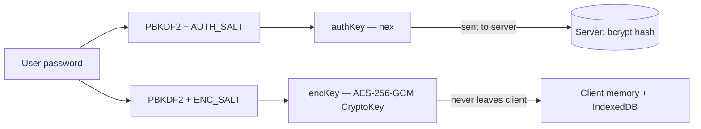
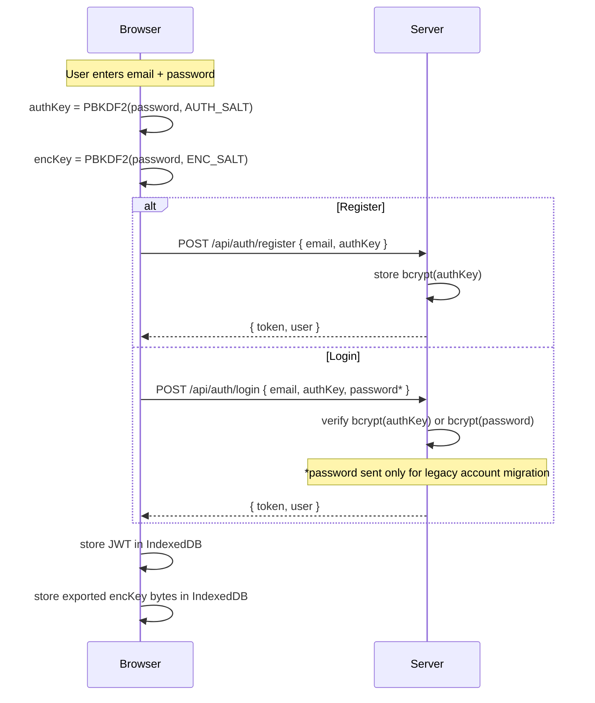
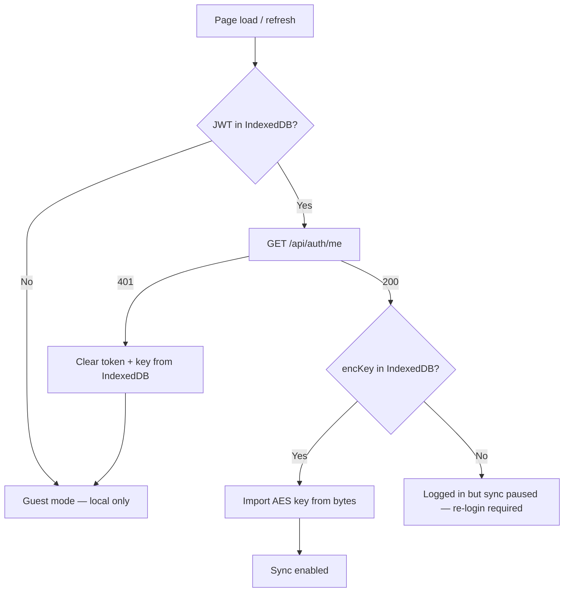
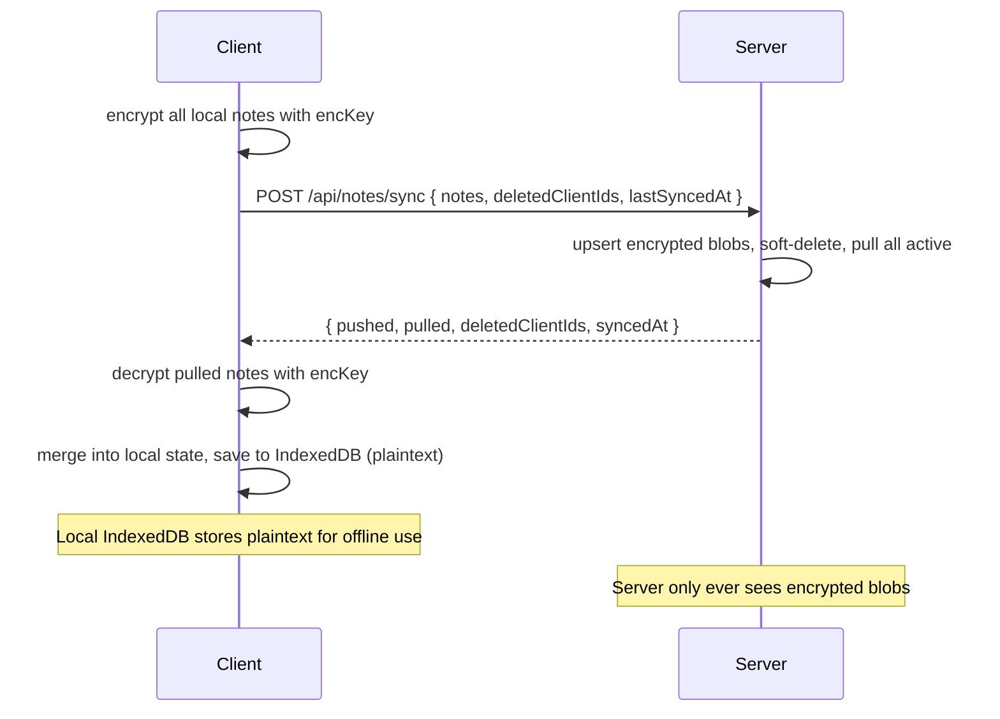
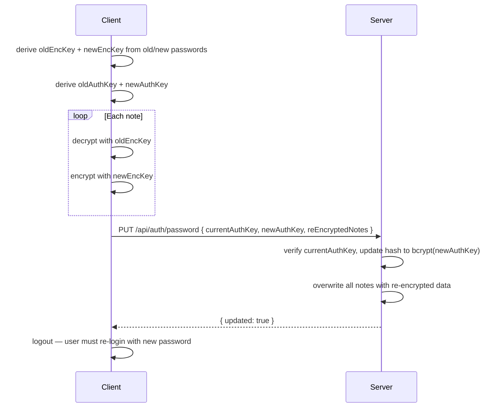

# Calc Notes

A free and open-source natural language calculator with notes. Built with Nuxt 4, Vue 3, and CodeMirror.

Write calculations naturally alongside notes, with live results, unit conversions, currency exchange, and more — all client-side in the browser.

## Prerequisites

- Node.js 22.20.0 (pinned in `mise.toml` — use [mise](https://mise.jdx.dev/) or nvm)
- npm

## Getting started

```bash
cp .env.example .env       # configure environment (see .env.example)
npm install
npm run dev                 # http://localhost:3000
```

## Scripts

| Command | Description |
|---|---|
| `npm run dev` | Start dev server with HMR |
| `npm run build` | Production build (outputs to `.output/`) |
| `npm run preview` | Preview production build locally |
| `npm run generate` | Static site generation |
| `npm run test` | Run all tests once (vitest) |
| `npm run test:watch` | Run tests in watch mode |

## Project structure

```
├── app.vue                        # Root app component
├── db.js                          # Dexie (IndexedDB) database schema
├── pages/
│   ├── index.vue                  # Main SPA page — editor, sidebar, modals
│   └── shared/
│       └── [hash].vue             # Public shared-note viewer
├── components/
│   ├── AboutModal.vue             # About / credits modal
│   ├── AccountMenu.vue            # User account dropdown
│   ├── AppHeader.vue              # Top bar with title, menus, and actions
│   ├── AuthModal.vue              # Login / register modal
│   ├── AvatarEditor.vue           # Avatar upload / crop
│   ├── ConfirmBulkDeleteModal.vue # Bulk-delete confirmation
│   ├── ConfirmDeleteModal.vue     # Single-delete confirmation
│   ├── DropdownItem.vue           # Reusable dropdown menu item
│   ├── DropdownSubmenu.vue        # Nested dropdown submenu
│   ├── ExportOptionsModal.vue     # Export format picker
│   ├── FileDropdown.vue           # File menu dropdown
│   ├── FormattingToolbar.vue      # Markdown formatting toolbar
│   ├── HelpModal.vue              # In-app documentation modal
│   ├── LanguageSwitcher.vue       # i18n locale selector
│   ├── MainSidebar.vue            # Notes list sidebar with search, tags, CRUD
│   ├── NoteEditor.vue             # CodeMirror editor wrapper with calc integration
│   ├── NoteListItem.vue           # Single note row in the sidebar
│   ├── NoteMetaModal.vue          # Note rename / metadata / share modal
│   ├── ProfileModal.vue           # User profile, password change, data deletion
│   ├── SettingsModal.vue          # Locale and display preferences
│   ├── ShareAnalyticsModal.vue    # Shared note view analytics
│   ├── SharedNoteToolbar.vue      # Toolbar for the public shared-note page
│   ├── ShareModal.vue             # Share a note (password, link, analytics)
│   ├── SidebarFooter.vue          # Sidebar bottom bar (account, settings)
│   ├── SyncIndicator.vue          # Sync status indicator
│   ├── TemplatesModal.vue         # Calculation templates picker
│   ├── ThemeSwitcher.vue          # Light / dark mode toggle
│   ├── ViewDropdown.vue           # View menu dropdown
│   └── WelcomeWizard.vue          # First-run onboarding wizard
├── composables/
│   ├── calculator/                # Calculator engine modules
│   │   ├── index.js               # Main entry — line-by-line pipeline
│   │   ├── aggregation.js         # sum / total / average
│   │   ├── constants.js           # pi, e, tau, phi, etc.
│   │   ├── currency.js            # Live exchange rates + conversion
│   │   ├── datetime.js            # Date / time / duration / timezone
│   │   ├── math.js                # Arithmetic, functions, trig, bitwise
│   │   ├── scales.js              # k, M, billion, trillion, SI prefixes
│   │   └── units.js               # Unit conversion (length, weight, …)
│   ├── useApi.js                  # API fetch wrapper (app-level)
│   ├── useApiBase.js              # Base fetch helper (shared with shared page)
│   ├── useAuth.js                 # Auth state, key derivation, session persistence
│   ├── useCalcLanguage.js         # Custom CodeMirror language (calcnotes)
│   ├── useCalculator.js           # Calculator composable (delegates to calculator/)
│   ├── useCodeHighlight.js        # Syntax highlighting helpers
│   ├── useDisplayFormatter.js     # Number / result display formatting
│   ├── useFileActions.js          # Export, import, duplicate, print
│   ├── useKeyboardShortcuts.js    # Global keyboard shortcut bindings
│   ├── useLocalePreferences.js    # Locale and display preferences state
│   ├── useNativeKeyboardToolbar.ts # iOS native keyboard accessory bridge
│   ├── useNotes.js                # Note CRUD + IndexedDB persistence
│   ├── usePlatform.js             # Platform detection (web, ios, android)
│   ├── useSync.js                 # Cloud sync with E2E encryption
│   ├── useTemplates.js            # Predefined calculation templates
│   └── useWelcomeWizard.js        # First-run wizard state
├── utils/
│   ├── crypto.js                  # E2E encryption: key derivation, AES-GCM encrypt/decrypt
│   └── keyboard-toolbar.ts        # Native keyboard toolbar utilities
├── plugins/
│   ├── pwa.client.ts              # PWA service worker registration
│   └── statusbar.client.ts        # Mobile status bar styling
├── server/
│   ├── api/
│   │   ├── auth/
│   │   │   ├── register.post.js   # POST /api/auth/register — create account
│   │   │   ├── login.post.js      # POST /api/auth/login — authenticate
│   │   │   ├── me.get.js          # GET  /api/auth/me — validate session
│   │   │   ├── profile.put.js     # PUT  /api/auth/profile — update profile
│   │   │   ├── password.put.js    # PUT  /api/auth/password — change password + re-encrypt
│   │   │   ├── privacy.put.js     # PUT  /api/auth/privacy — tracking preferences
│   │   │   └── delete.post.js     # POST /api/auth/delete — delete data or account
│   │   ├── notes/
│   │   │   ├── index.get.js       # GET  /api/notes — list notes
│   │   │   ├── index.post.js      # POST /api/notes — create / upsert note
│   │   │   ├── [id].put.js        # PUT  /api/notes/:id — update note
│   │   │   ├── [id].delete.js     # DELETE /api/notes/:id — soft-delete note
│   │   │   └── sync.post.js       # POST /api/notes/sync — bulk sync endpoint
│   │   ├── share/
│   │   │   ├── index.post.js      # POST /api/share — create shared note
│   │   │   ├── my.get.js          # GET  /api/share/my — list user's shares
│   │   │   ├── [hash].get.js      # GET  /api/share/:hash — view shared note
│   │   │   ├── [hash].delete.js   # DELETE /api/share/:hash — unshare
│   │   │   └── [hash]/
│   │   │       ├── analytics.get.js    # GET  — view analytics
│   │   │       ├── analytics.delete.js # DELETE — clear analytics
│   │   │       └── import.post.js      # POST — record import event
│   │   └── sync/
│   │       └── events.get.js      # GET /api/sync/events — SSE endpoint
│   ├── middleware/
│   │   └── cors.js                # CORS headers for API routes
│   ├── plugins/
│   │   └── migrate.js             # Auto-run DB migrations on startup
│   └── utils/
│       ├── auth.js                # JWT sign / verify, requireAuth helper
│       ├── db.js                  # PostgreSQL connection pool + query helper
│       ├── migrate.js             # SQL migration runner
│       └── syncBroadcast.js       # SSE broadcast to connected clients
├── locales/
│   ├── en-GB.json                 # English translations
│   ├── es-ES.json                 # Spanish translations
│   └── pages/
│       ├── index/                 # Page-scoped translations (main page)
│       └── shared-hash/           # Page-scoped translations (shared page)
├── tests/
│   ├── calculator/                # Calculator engine tests (by module)
│   │   ├── helpers.js             # Shared test helpers
│   │   ├── aggregation.test.js
│   │   ├── arithmetic.test.js
│   │   ├── currency.test.js
│   │   ├── datetime.test.js
│   │   ├── fuelconsumption.test.js
│   │   ├── functions.test.js
│   │   ├── localePreferences.test.js
│   │   ├── spaceless_units.test.js
│   │   ├── units.test.js
│   │   └── variables.test.js
│   ├── server/                    # Server API tests
│   │   ├── auth-delete.test.js
│   │   ├── auth-login.test.js
│   │   ├── auth-password.test.js
│   │   ├── auth-register.test.js
│   │   ├── share-create.test.js
│   │   ├── share-get.test.js
│   │   └── sync.test.js
│   ├── calcLanguage.test.js       # CodeMirror language tests
│   ├── codeHighlight.test.js      # Syntax highlighting tests
│   ├── crypto.test.js             # Crypto unit tests
│   ├── crypto-integration.test.js # Crypto integration tests
│   ├── fileActions.test.js        # Export / import tests
│   ├── localePreferences.test.js  # Locale preferences tests
│   └── logout-safety.test.js      # Logout + sync guard tests
├── public/
│   ├── favicon.ico
│   ├── icon-192x192.svg
│   ├── icon-512x512.svg
│   ├── manifest.webmanifest
│   ├── robots.txt
│   └── sw.js                      # Service worker for PWA
├── nuxt.config.ts                 # Nuxt configuration (SSR disabled, modules, i18n)
├── tailwind.config.js             # Tailwind with custom color palette
├── vitest.config.js               # Vitest configuration
├── capacitor.config.ts            # Capacitor config (iOS + Android)
├── Dockerfile                     # Multi-stage production build
├── docker-compose.yml             # Production Postgres
├── docker-compose.dev.yml         # Local dev Postgres
└── mise.toml                      # Node.js version pinning
```

## Architecture

The app is a pure client-side SPA (`ssr: false` in `nuxt.config.ts`). All data is stored locally in IndexedDB via Dexie.js — there is no backend or database required for the current feature set.

### Key modules

- `useCalculator.js` — The core engine. Parses natural language input and evaluates arithmetic, percentages, unit conversions, currency exchange, date/time, variables, and aggregation (sum/average). This is where most of the logic lives and where most contributions will happen.
- `useCalcLanguage.js` — Registers a custom CodeMirror language (`calcnotes`) with syntax highlighting for numbers, operators, units, currencies, functions, and comments.
- `useNotes.js` — Manages multiple notes with auto-save to IndexedDB via Dexie.js.
- `useTemplates.js` — Provides predefined templates (budget, cooking, fitness, etc.).

### Calculator engine overview

The calculator processes input line-by-line. Each line goes through this pipeline:

1. Check for formatting (headers `#`, comments `//`, labels `Label:`)
2. Check for variable assignment (`x = ...`)
3. Check for aggregation keywords (`sum`, `total`, `average`, `avg`)
4. Try timezone conversion
5. Try date/time expression
6. Try `fromunix()` function
7. Try number format conversion (`X in hex/bin/oct/sci`)
8. Try unit conversion (length, weight, volume, temp, area, speed, data, time, CSS, angular)
9. Try currency conversion
10. Fall back to regular math evaluation

Important implementation details:
- `mod` uses `⊘` as an internal placeholder to avoid conflict with the `%` percentage handler
- `xor` uses `⊕` to distinguish from `^` (exponentiation)
- Variable assignment is checked before sum/total keywords to prevent `total = X` from being caught as an aggregation
- The `times` word operator uses `\btimes\b` word boundary to avoid conflicts with date expressions
- Exchange rates are fetched live from [fawazahmed0/exchange-api](https://github.com/fawazahmed0/exchange-api) on startup, with hardcoded fallback rates for offline use

## Security & authentication

Calc Notes supports optional cloud sync with end-to-end encryption (E2E). The design ensures the server never has access to plaintext note content or the user's raw password.

### Key derivation

From a single user password, two independent keys are derived client-side using PBKDF2-SHA256 (600 000 iterations), each with a distinct salt:

| Key | Purpose | Leaves the client? |
|---|---|---|
| `authKey` | Hex string sent to the server for authentication | Yes (server stores `bcrypt(authKey)`) |
| `encKey` | AES-256-GCM key used to encrypt/decrypt notes | Never |



### Registration & login



On login the server tries `authKey` first. For legacy accounts (created before E2E), it falls back to the raw password and transparently upgrades the stored hash to `bcrypt(authKey)`.

### Session persistence across page refresh

The JWT token and the exported `encKey` bytes (base64-encoded) are both persisted in IndexedDB via the Dexie `appState` table. This means the session survives page refreshes, tab closures, and browser restarts. Both are cleared on logout.

On page load, `restore()` recovers the JWT from IndexedDB, validates it against the server (`GET /api/auth/me`), and re-imports the `encKey` from IndexedDB. If either is missing or the token is invalid, the user must log in again.



### Encryption format

All sensitive note fields (title, description, tags, content) are encrypted individually with AES-256-GCM before being sent to the server. Each encrypted field is a JSON string:

```json
{ "iv": "<base64 — 12-byte nonce>", "ct": "<base64 — ciphertext + 16-byte auth tag>" }
```

The server stores these opaque strings as-is. Non-sensitive fields (clientId, sortOrder, timestamps) pass through unencrypted.

### Sync flow



Sync triggers: immediate on create/delete/reorder, debounced (3 s) on edits, 2-minute interval, and SSE push from other clients.

### Password change

Password change re-encrypts all notes atomically:



### Shared notes

Shared notes use a completely separate key derived from a share-specific password (user-chosen or randomly generated) with its own PBKDF2 salt (`SHARE_SALT`). This key is independent from the user's personal `encKey`.

### Legacy migration

On the first sync after E2E deployment, the client detects unencrypted (legacy) notes from the server by checking whether the `content` field parses as a `{ iv, ct }` JSON object. Legacy notes are used as-is locally and then re-uploaded encrypted in a one-time migration pass with a progress indicator.

### Known security limitations

The following items are known trade-offs or areas for future improvement:

1. **Hardcoded PBKDF2 salts** — The three salts (`AUTH_SALT`, `ENC_SALT`, `SHARE_SALT`) are static strings compiled into the client bundle. Ideally, salts should be per-user and stored server-side. This is acceptable for now because the salts serve to domain-separate the three derived keys (not to prevent rainbow tables — PBKDF2's iteration count handles that), but per-user salts would be stronger.

2. **Derived key in IndexedDB** — The raw AES-256 key bytes are stored in IndexedDB (base64-encoded via the Dexie `appState` table) to survive page refreshes and tab closures. Unlike `sessionStorage`, this persists across browser sessions until the user explicitly logs out. The key is accessible to any JavaScript running in the same origin, so an XSS vulnerability could exfiltrate it. Alternatives considered:
   - Non-extractable CryptoKey (original approach) — prevents export but is lost on refresh, breaking sync.
   - `sessionStorage` — tab-scoped and cleared on tab close, but doesn't survive tab closures or browser restarts, forcing frequent re-logins.
   - Service Worker vault — would isolate the key from the main thread but adds significant complexity.

3. **No key rotation mechanism** — There is no periodic key rotation. The `encKey` only changes when the user changes their password. A future improvement could introduce versioned keys.

4. **Server-side note metadata exposure** — While note content fields are encrypted, the server can still observe: number of notes, note sizes, timestamps, sort order, and sync frequency. A padding or fixed-size scheme could mitigate size-based analysis.

5. **JWT in IndexedDB** — The JWT is stored in IndexedDB (not httpOnly cookie) because the app is a client-side SPA that calls the API directly. This means the token is accessible to JavaScript and vulnerable to XSS. The token has an expiry, but there is no refresh token rotation yet.

6. **Legacy password fallback** — During the migration period, the login endpoint accepts both `authKey` and raw `password`. The raw password is sent over TLS but does reach the server. Once all accounts are migrated, the raw password fallback should be removed.

## Testing

Tests live in `tests/useCalculator.test.js` — 221 tests across 35 categories covering every calculator feature.

```bash
npm run test          # single run
npm run test:watch    # watch mode
```

### Test setup

The composable uses Nuxt's auto-imported `ref`. Since tests run outside Nuxt, we mock it:

```js
vi.stubGlobal('ref', (val) => ({ value: val }))
```

Tests use four helper functions:

```js
calc(expression)         // evaluate single expression, return result string
calcNum(expression)      // evaluate single expression, return parsed number
calcLines(lines)         // evaluate multiple lines, return all result strings
calcLinesLastNum(lines)  // evaluate multiple lines, return last result as number
```

### Test categories

1. Basic arithmetic
2. Word operators (plus, minus, times, divide, etc.)
3. Implicit multiplication
4. Number formats (binary, octal, hex)
5. Scientific notation output
6. Scales (k, M, billion, trillion)
7. Constants (pi, e, tau, phi)
8. Variables and assignment
9. Previous result (`prev`)
10. Percentages (all 9 operations)
11. Math functions (sqrt, cbrt, abs, log, ln, fact, round, ceil, floor)
12. Trigonometry (sin, cos, tan with degree support)
13. Inverse trig (arcsin, arccos, arctan)
14. Hyperbolic functions (sinh, cosh, tanh)
15. Unit conversion — length, weight, volume, temperature, area, speed, data, time
16. CSS units (px, pt, em, rem with custom ppi)
17. Angular units (degrees, radians)
18. Currency conversion (45+ currencies, live rates)
19. Date and time (now, today, yesterday, tomorrow, relative dates)
20. Duration calculations
21. `fromunix()` timestamp conversion
22. Sum and total aggregation
23. Average aggregation
24. Formatting (headers, comments, labels, inline comments)
25. Bitwise operations (AND, OR, XOR, shift)
26. SI prefixes
27. Compound unit expressions
28. Square/cubic prefixes for area/volume
29. Timezone conversion
30. Edge cases

### Writing new tests

When adding a calculator feature, add tests to the appropriate `describe` block in `useCalculator.test.js`. If it's a new category, add a new `describe` block following the existing numbering pattern. All tests must pass before merging.

## i18n

Translations use [nuxt-i18n-micro](https://github.com/nicholasio/nuxt-i18n-micro) with the `no_prefix` strategy (no URL prefixes).

Current locales: `en-GB`, `es-ES`

Translation files:
- `locales/{locale}.json` — global translations
- `locales/pages/index/{locale}.json` — page-scoped translations

To add a new locale:
1. Add the locale config to `nuxt.config.ts` under `i18n.locales`
2. Create the corresponding JSON files in `locales/` and `locales/pages/index/`
3. Copy the structure from `en-GB.json` files and translate

## Theming

Uses `@nuxtjs/color-mode` with `class` strategy (adds `dark` class to `<html>`). System preference is detected automatically.

Custom color palette is defined in `tailwind.config.js` with semantic names: `primary`, `success`, `warning`, `error`, and an extended `gray` scale optimized for dark mode.

## Docker

```bash
docker build -t calcnotes .
docker run -p 3000:3000 calcnotes
```

The Dockerfile uses a multi-stage build: build stage with full Node.js, production stage with just the `.output` directory running as a non-root user.

## Contributing guidelines

- All calculator logic goes in `composables/useCalculator.js`
- Every new feature must have corresponding unit tests
- Run `npm run test` before committing — all 221+ tests must pass
- The app is a client-side SPA — no server-side logic for calculator features
- Use Tailwind utility classes for styling, follow the existing color palette
- All user-facing strings must use i18n keys, not hardcoded text
- Components should be single-file Vue components in `components/`

## What the app does (quick reference)

Arithmetic, word operators, variables, percentages (9 operations), math functions, trig, unit conversions (10 categories), 45+ currencies with live rates, date/time arithmetic, timezone conversion, sum/average aggregation, number format conversion, bitwise operations, and more. See the in-app help modal or `tests/useCalculator.test.js` for the full feature list with examples.

## License

GPLv3 — see [LICENSE](LICENSE) for details.
